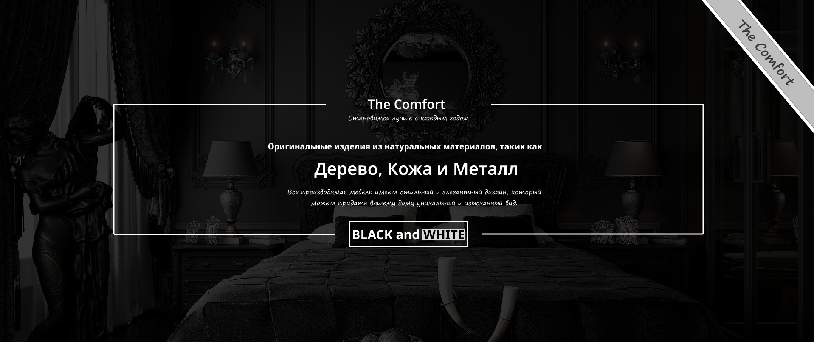

# Comfort - Мебельный landing

Один из моих первых проектов по веб-разработке - лендинг для мебельной компании "Comfort". Учебный проект, созданный для отработки навыков верстки и фронтенд-разработки.

## 🚀 О проекте

Лендинг для компании, занимающейся продажей качественной мебели.

Цель проекта - освоить основы современной верстки, работу с препроцессорами и организацию проекта.

## 🛠 Технологии

- **HTML5** - семантическая верстка
- **CSS3/SCSS** - стилизация и препроцессор
- **JavaScript** - интерактивность
- **Figma** - работа с дизайн-макетами

## 📁 Структура проекта
- css - Скомпилированные CSS файлы
- scss - Исходные SCSS файл
- js - JavaScript файлы
- img - Изображения и иконки
- img - Изображения и иконки
- pages - Cтраницы
- favicon - Фавиконки для разных устройств
- Figma - Дизайн-макеты и исходники
- README.md - Документация
